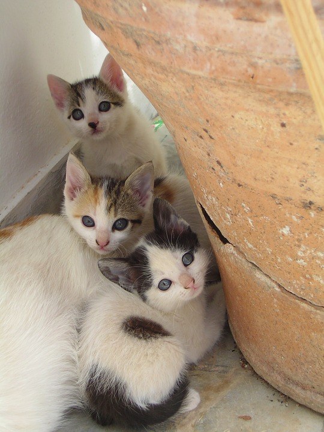

### PRESENTACION   1

                  MI GATO HACE MIAU MIAU... EL GATO QUE ESTA TRISTE Y AZUL                  
    Cuando era un chiquillo que alegría<!-- .slide: data-background="#55CCEE" -->
    jugando a la guerra noche y día<!-- .slide: data-background="#55CCEE" -->
    saltando una verja verte a ti<!-- .slide: data-background="#55CCEE" -->
    y asi en tus ojos algo nuevo descubrir 
+++{Las rosas decían que eras mía
y un gato me hacía compañia
desde que me dejáste yo no se
porqué la ventana es más grande sin tu amor    <!-- .slide: data-background="#55CCEE" -->
    <!-- .slide: data-background="#fff555" -->

---EL GATO QUE ESTA TRISTE Y AZUL                  
Cuando era un chiquillo que alegría
jugando a la guerra noche y día
saltando una verja verte a ti
y asi en tus ojos algo nuevo descubrir
Las rosas decían que eras mía
y un gato me hacía compañia
desde que me dejáste yo no se
porqué la ventana es más grande sin tu amor

El gato que esta en nuestro cielo
no va a volver a casa si no estás
no sabes mí amor que noche bella
presiento que tu estas en esa estrella

El gato que está triste y azul
nunca se olvida que fuiste mía
más se sabrá de mí sufrir
porque en mis ojos ... una lagrima hay
<!-- .slide: data-background="#55CCEE" -->
___
Querida querida vida mía
Reflejo de luna que reía
si amar es errado culpa mía
Te amé en el fondo que es la vida no lo se

El gato que esta en nuestro cielo
no va a volver a casa si no estás
no sabes mí amor que noche bella
presiento que tu estas en esa estrella

El gato que esta triste y azul
nunca se olvida que fuiste mía
más siempre seras en mí mirar
lagrima clara de primavera
El gato que esta en la oscuridad
sabe que en mi alma una lagrima hay

El gato que esta triste y azul
nunca se olvida que fuiste mía
más siempre seras en mí mirar
lagrima clara de primavera
<!-- .slide: data-background="#9bc32f" -->
___
El gato que esta triste y azul
nunca se olvida que fuiste mía
más siempre seras en mí mirar
lagrima clara de primavera
<!-- .slide: data-background="#ff3333" -->
___

<!-- .slide: data-background="#55CCEE" -->

<!-- .slide: data-background="#9bc32f" -->
___
[***énfasis*** (cursiva)]
---
<!-- .slide: data-background="#ff3333" -->
<!-- .slide: data-background="#ffff11" -->
### Encabezado h1
<!-- .slide: data-background="#f900c1" -->
# Encabezado h1

# La alegria esta en el alma y no en la edad
# todos llevamos por dentro ese niño que no
# deberiamos ocultar nunca.
<!-- .slide: data-background="#00ff44" -->
---
La vida es muy corta para aprender Alemán. -Tad Marburg

<!-- .slide: data-background="#eeee00" -->

Quien no sabe llevar su contabilidad por espacio de tres mil años es un ignorante y solo vive al dia. - L. W. Goethe
<!-- .slide: data-background="#fff000" -->
---
<!-- .slide: data-background="#ff4444" -->
*** FGDGJKJGKLÑ***

---
Yo sólo quiero mirar los campos,
yo sólo quiero cantar mi canto,
pero no quiero cantar solito,
yo quiero un coro de pajaritos.

Quiero llevar este canto amigo
a quién lo pudiera necesitar
Yo quiero tener un millón de amigos
y así más fuerte poder cantar.
Yo quiero tener un millón de amigos
y así más fuerte poder cantar.

Yo sólo quiero un viento fuerte,
llevar mi barco con rumbo norte,
y en el trayecto voy a pescar
para dividir luego al arrivar.

Quiero llevar este canto amigo ...
___
Yo quiero creer la paz del futuro
quiero tener un hogar seguro.
Quiero a mi hijo pisando firme,
cantando alto, sonriendo libre.

Quiero llevar este canto amigo ...

Yo quiero amor siempre en esta vida,
sentir calor de una mano amiga,
quiero a mi hermano sonrisa al viento,
verlo llorar pero de contento.

Quiero llevar este canto amigo ...

Venga conmigo a ver los campos
cante conmigo también mi canto
pero no quiero cantar solito
yo quiero un coro de pajaritos
___
  
---

<!-- .slide: data-background="#ff8888" -->
#IMAGEN  "#9bc32f" -->

